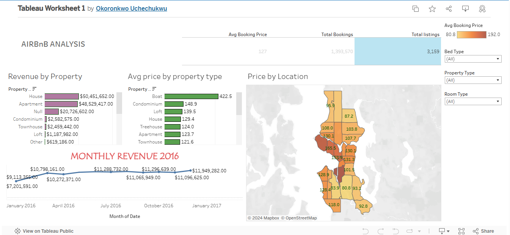
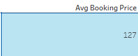
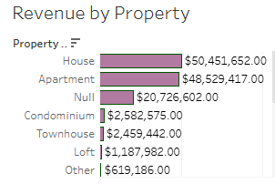
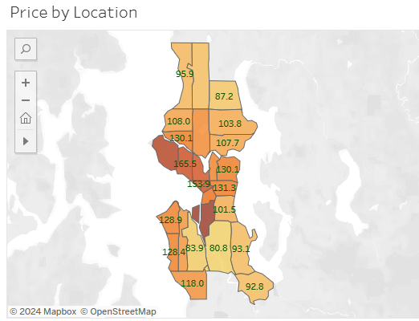
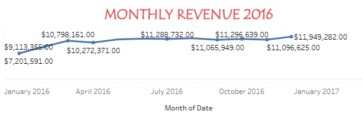

# Seattle_Airbnb_Analysis

## by Uchechukwu Okoronkwo

___
# Introduction
___
Tourists and other visitors who go to other parts of the world including Seattle in the US have found ways to use Airbnb in a unique and personalized manner. It was based on this, that this analysis was carried out. It described and developed insights to the listing acivities of homestays in Seattle, WA, USA. This project analysis was directed at analysing the dataset on an Airbnb business in the city of Seattle, USA using Tableau ensuring the unveiling of valuable insights that will propel the business to more successful operations and better customer satisfaction. 
___
# Problem Statement
___
Inorder to understand the business and provide useful insights in relation to the operational performance and customer perferences, the following areas of the business were looked at:
1) The Average Booking Price
2) The Total Bookings
3) The Total Listing
4) Revenue generated by each property
5) Average price according to each property
6) Price by Location
7) Monthly revenue for the year 2016 
The first three were the key performance indices (KPI)
___
# Data Source
___
The dataset for this analysis was got online from Kaggle.com.
___
# Data Modelling
___
This is a crucial step in Tableau to ensure that the analysis is accurate and effective. It involves building relationships between tables, creating calculated fields and optimizing the data structure for insightful visualizations. Here I had to create a relationship between the tables to ensure seamless interactions.
___
# Skills Demonstrated
___
Data cleaning was done in Ms Excel before it was imported into the Tableau workspace. Since I had already cleaned the data, there was almost no need for data shaping and re-structuring. I went on to work on the calculated fields, creating custom calculations using mathematical functions and formulas to drive new metrics. Next, I moved to creating visualizations using different charts and a map for location. This in effect brought out the data storytelling in a clear and compelling way. These visuals were now used to develop an interactive dashboard.
___
# Analysis and Visualization
___
Only one dashboard was generated for this report.

Here is the link to the dashboard: https://public.tableau.com/app/profile/okoronkwo.uchechukwu/viz/TableauWorksheet1_17151651790130/Dashboard1?publish=yes
___

Question 1:
What is the average booking price?
___

___
Question 2:
What is the total bookings?

___
Question 3:
What is the total listings?

.png)

___
Question 4:
What revenue was generated by each property?

___
Question 5:
What is the average price for each property type?

___
Question 6:
What is the price generated for each location?

___
Question 7:
What was the revenue generated each month for the year 2016?

___
# Recommendations & Conclusion
___
From the above analysis, the following were the recommendations made;

1) There should be a direct focus on the high-demand neighbourhoods, priotize investments in those areas for more profit.
2) Listing with high ratings tend to have better amenities so there should be improvement on property features this will lead to high customer satisfaction.
3) Be concious of high-demand periods and make pricing adjustments to maximize profit.

In conclusion, this analysis has provided valuable insights into factors that if worked on will improve the Airbnb market and also lead to greater customer satisfaction.
